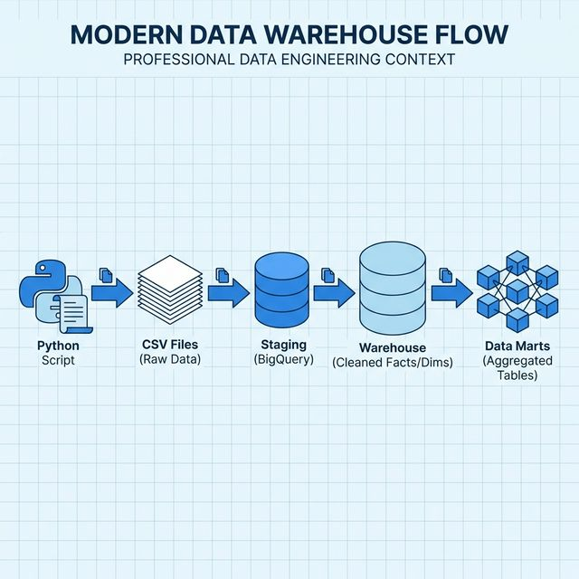

# Modern BigQuery Data Warehouse

This project implements a modern ELT data warehouse using BigQuery and dbt.

## Architecture


graph LR
    subgraph Ingestion
    Gen[Python Generator] -->|Writes CSVs| Raw[Raw Data (CSVs)]
    end

    subgraph BigQuery_ELT
    Raw -->|Load (bq load)| Stg[Staging Views]
    Stg -->|dbt (Clean)| WH[Warehouse (Facts/Dims)]
    WH -->|dbt (Agg)| Marts[Data Marts]
    end

    classDef source fill:#e1f5fe,stroke:#01579b,stroke-width:2px;
    classDef storage fill:#fff3e0,stroke:#e65100,stroke-width:2px;
    classDef process fill:#e8f5e9,stroke:#2e7d32,stroke-width:2px;

    class Gen, Raw source;
    class Stg, WH, Marts storage;
```



## Project Structure

*   `dbt_project/`: Contains all dbt models, tests, and configuration.
    *   `models/staging`: Raw data cleaning and standardization.
    *   `models/warehouse`: Core Dimensional Models (Star Schema).
    *   `models/marts`: Aggregated Data Marts for BI.
*   `ingestion/`: Python scripts for data generation and ingestion.
*   `infrastructure/`: Helper scripts for GCP resource setup.

## Setup & Usage

### 1. Install Dependencies

```bash
pip install -r requirements.txt
```

### 2. Generate Synthetic Data

Run the data generator to create CSV files in `ingestion/data/`.

```bash
python ingestion/scripts/generate_data.py
```

### 3. dbt Configuration

Ensure you have a `profiles.yml` configured for your BigQuery project.

### 4. Run dbt

```bash
cd dbt_project
dbt deps
dbt build
```

## Infrastructure Provisioning (Terraform)

Instead of manual scripts, use Terraform to manage GCP resources.

1.  Navigate to the `terraform` directory:
    ```bash
    cd terraform
    ```

2.  Initialize Terraform:
    ```bash
    terraform init
    ```

3.  Plan and Apply:
    ```bash
    terraform plan -var="project_id=YOUR_PROJECT_ID"
    terraform apply -var="project_id=YOUR_PROJECT_ID"
    ```

## Key Features

*   **Partitioning**: `fact_orders` is partitioned by `order_placed_at` (Day).
*   **Clustering**: `fact_orders` is clustered by `user_id` and `status`.
*   **Dimensional Modeling**: Users (Dim) and Orders (Fact) star schema.
